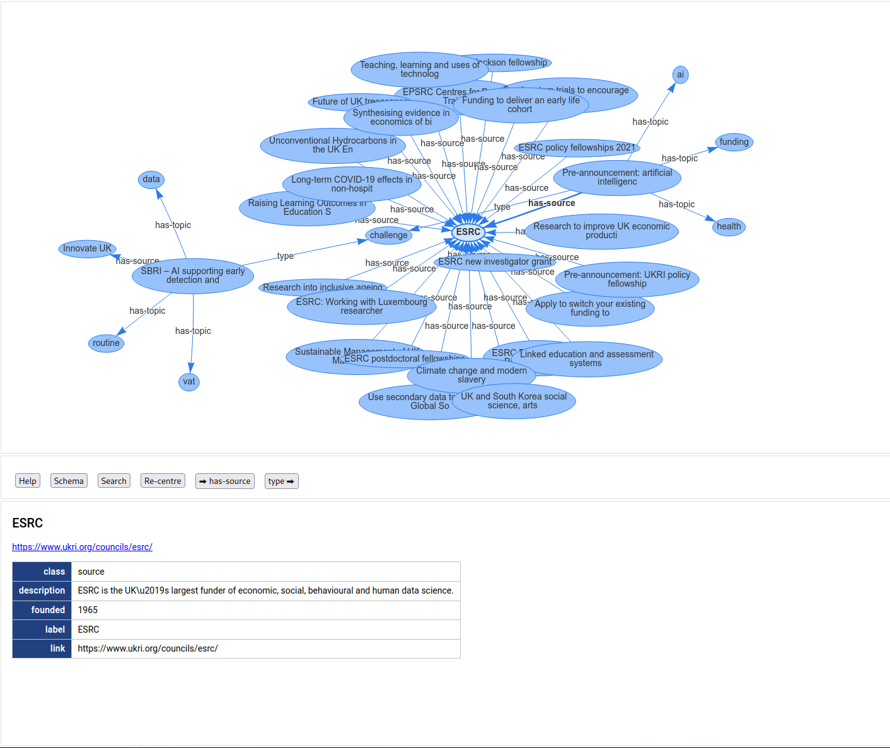

# SPARQL Sleuth

This is a client-side web application which allows the user to discover
information from a SPARQL endpoint by interacting with a representation
of the underlying knowledge graph.

## Screenshot



## How it works

This is a web application built using Angular.  Building the application
results in a set of resources which should be served from a web server.

The application is self-contained once built with the exception that
it needs a SPARQL endpoint at the /sparql relative
URL.  This is not provided by the Angular application, but should be
provided by the web service on which the application is hosted.

One option is to get the web server to reverse-proxy /sparql to a
real SPARQL service elsewhere on the internet.

The application works by POSTing SPARQL queries to the endpoint.

## Web proxy

There is a bundled web proxy/serve.go written in Golang, which can be used
to redirect /sparql to another host.

## See also

I have a SPARQL service at https://github.com/cybermaggedon/sparql-service
which can be used with simple RDF datasets, maybe not good for larger
datasets or scalable services beyond 1 billion edges.

## Deployment

### Container

Easiest way to deploy is to use the containers I have
built: docker.io/cybermaggedon/sparql-sleuth which bundles both the
built Angular application plus the web proxy.  The only thing you
need to do is tell the application where the SPARQL endpoint is, and you do
this by setting the container command line.  It should take the form:

```
  /usr/local/bin/serve 0:8080 SPARQL_HOST:PORT SCHEME .
```
but replace `SPARQL_HOST` with the hostname of your SPARQL service,
`PORT` with the SPARQL endpoint's port number, and replace `SCHEME`
with either `http` or `https` depending on which the SPARQL endpoint uses.
If it's not set up with TLS, use `http`.

For a SPARQL service, my repo
`https://github.com/cybermaggedon/sparql-service` can be easily used for
small RDF datasets which are built into a `sqlite` database.

### Alternatively

You need to:
- Build the Angular application with `ng build -c production`
- The resultant web application is built to `dist/sparql-sleuth`, and
  you need to put that on your web server.
- Redirect /sparql on your web server to the SPARQL endpoint.

## Development

You need to run:
- `ng serve` to run the SPARQL application on port 4200.
- Some sort of proxy.  I use the code in `proxy/serve-local.go` to
  redirect to the SPARQL endpoint and Angular service.
- A SPARQL service.

e.g. to list on port 8080, redirect to a SPARQL endpoint on
`http://localhost:8089`:
```
./serve-local 0:8080 localhost:8089 http .
```

